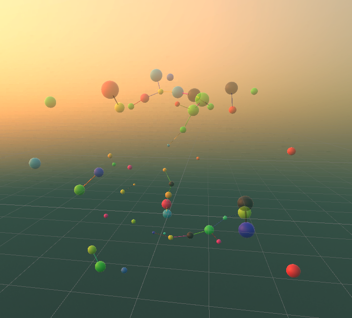

# Build Instructions
  
**Similar project:** https://vasturiano.github.io/react-force-graph/example/highlight/

---
## Part 1 - Setup Oculus and build environment
Note: Windows computer required.

1. **Computer:** Create Oculus Developer Account
2. **Phone:** Get Oculus app on phone and login with developer account
3. **Oculus:** (Optional) Turn device off then hold the power and volume down button on the headset for factory reset
4. **Oculus:** Complete setup
5. **Phone:** Pair Oculus with phone
6. **Phone:** Enable Developer Mode under headset settings
7. **Oculus:** Enable Hand Tracking in settings
8. **Computer:** Install Oculus app and login with developer account
9. **Computer:** Enable Unknown Sources in Oculus app settings
10. **Computer:** Pair headset using usb c cable
11. **Oculus:** Allow computer to access files, select always allow usb debugging, and enable quest link
12. **Computer:** Download Visual Studio 2022 Community and install the Unity package
13. **Computer:** Install Unity Hub and sign in with Unity account
14. **Computer:** Install Editor with Android Build Support, but do not install Visual Studio again
15. **Computer:** Create 3D Core project in Unity
16. **Computer:** Import Oculus Integration asset to Unity project
17. **Computer:** Open project settings and install XR Plugin Management
18. **Computer:** Under XR Plug-in Management check Oculus under the Windows and Android tabs
19. **Computer:** Under the Oculus tab, under the Android tab, check all target devices
20. **Computer:** Add OculusInteractionSampleRig to the scene and remove the main camera
21. **Oculus:** Connect Oculus to computer and open Quest Link
22. **Computer:** Click play in Unity and the app should work on the headset
23. **Computer:** Open Build Settings in Unity and select Android
24. **Computer:** Select Oculus Quest as the run device and click build and run (Ctrl+B)
25. **Oculus:** Run the app from the Unknown Sources section of the apps menu


---
## Part 2 - Specific Project Setup
Note: All steps on computer for this section.

### Hand Tracking and Interaction
- Set Hand Tracking Support to Hands Only under OculusIntegrationSampleRig -> OVRCameraRig -> General
- Set Hand Tracking Frequency to MAX
- Add the HandGrabInteractor prefab under OculusIntegrationSampleRig -> InputOVR -> Hands -> LeftHand -> HandInteractorsLeft, repeat for the right hand

### Scripts
- Import scripts into assets (script name must match class name)
- Create Empty called ScriptRunner in the scene and add the Main script to it
- Public variables will be accessible under the ScriptRunner
- **Select Visual Studio in Edit -> Preferences -> External Tools**
- **Open Visual Studio by selecting Assets -> Open C# Project**

### Connections
- Create a cylinder object in the scene with a scale of (0.1, 0.1, 0.1)
- Create a prefab called Connection from the cylinder
- Unselect the capsule collider component
- Add the prefab to the ScriptRunner and delete the cylinder from the scene

### Nodes
- Create a sphere object in the scene with a scale of (0.1, 0.1, 0.1)
- Select Is Trigger under Sphere Collider
- Add a Rigidbody to the sphere, unset kinematic, unset gravity, set Collision Detection to Continuous Dynamic, and set Interpolation to Interpolate
- Add the Grabbable script to the sphere
- Add the Hand Grab Interactable script to the sphere and set supported grab types to Everything
- Add the Pointable Unity Event Wrapper to the sphere **NOT DONE**
- Create a prefab called Node from the sphere
- Drag the node prefab to the Node option under Pointable Unity Event Wrapper and select Grabbable
- Add the prefab to the ScriptRunner and delete the sphere from the scene

### Scale Object
- Create a cube called ScaleObject in the scene with a scale of (5, 5, 5) and position of (0, 2.5, 0)
- Deselect the Mesh Renderer component to make it invisible
- Add a Rigidbody to the cube, unset kinematic, unset gravity, set Collision Detection to Continuous Dynamic
- Add the Grabbable script to the cube
- Add the Hand Grab Interactable script to the cube and set supported grab types to Pinch
- Add the Two Grab Free Transformer script to the cube
- Drag the Two Grab Free Transformer script to the Two Grab Transformer option under Grabbable
- Add the cube to the ScriptRunner script

### Remove Default Skybox
- Window -> rendering -> lighting settings -> environment -> skybox material -> none
- Remove the default directional light

### List all componenets of an object (helpful for debugging)
```csharp
Component[] components = gameObject.GetComponents(typeof(Component));
foreach(Component component in components) {
    Debug.Log(component.ToString());
}
```

---
## Part 3 - Optimizations
- Build Settings -> ASTC texture compression
- Quality Settings -> Low quality
- Player Settings -> Graphics API -> OpenGLES3
- Player Settings -> Other Settings -> Configuration -> Scripting Backend -> IL2CPP
- Player Settings -> Other Settings -> Configuration -> Scripting Backend -> ARM64
- XR Plugin Management -> Oculus -> Low Overhead Mode
